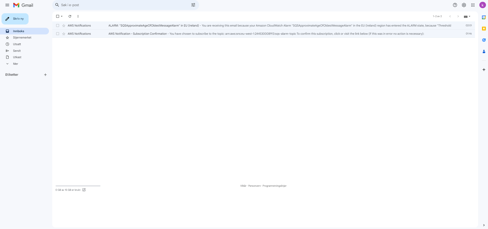
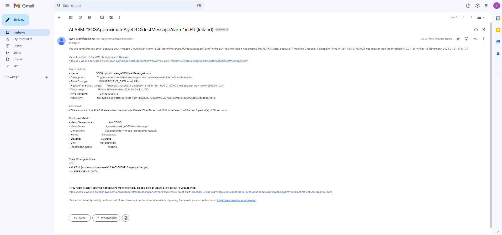

# README

## Oppgave 1

- **HTTP Endepunkt for Lambdafunksjonen som sensor kan teste med Postman**:
  - [https://86pufabpl5.execute-api.eu-west-1.amazonaws.com/Prod/generate-image](https://86pufabpl5.execute-api.eu-west-1.amazonaws.com/Prod/generate-image)  <!-- Updated endpoint -->

- **Lenke til kjørt GitHub Actions workflow**:
  - [https://github.com/Ernttimus/pgr301-exam-2024/actions/runs/11843678495/job/33008024357](https://github.com/Ernttimus/pgr301-exam-2024/actions/runs/11843678495/job/33008024357)

---

## Oppgave 2

- **Lenke til kjørt GitHub Actions workflow (MAIN)**:
  - [https://github.com/Ernttimus/pgr301-exam-2024/actions/runs/11843678501/job/33005925210](https://github.com/Ernttimus/pgr301-exam-2024/actions/runs/11843678501/job/33005925210)

- **Lenke til en fungerende GitHub Actions workflow (ikke main)**:
  - [https://github.com/Ernttimus/pgr301-exam-2024/actions/runs/11843573878/job/33005973793](https://github.com/Ernttimus/pgr301-exam-2024/actions/runs/11843573878/job/33005973793)

- **SQS-Kø URL**:
  - [https://sqs.eu-west-1.amazonaws.com/244530008913/image_processing_queue](https://sqs.eu-west-1.amazonaws.com/244530008913/image_processing_queue)

---

## Oppgave 3

- **Beskrivelse av taggestrategi**: 
  - Taggestrategien jeg har brukt er latest. Det for å gjøre det enkelt for meg å se nyeste eller det siste som har blitt pusha inn i docker repoet mitt. Dersom jeg puller vil nyeste utgave bli brukt.

- **Container image + SQS URL**:
  - **Container Image**: `testeksamenkr/java-sqs-client`
  - **SQS URL**: [https://sqs.eu-west-1.amazonaws.com/244530008913/image_processing_queue](https://sqs.eu-west-1.amazonaws.com/244530008913/image_processing_queue)

---

## Oppgave 4

- **Her ser du meldingene jeg har fått, jeg bekreftet at jeg vill subscribe til tjenesten**:
  
  
  
- **Her er meldingen jeg fikk**:
  
  

## Oppgave 5

## Automatisering og kontinuerlig levering (CI/CD): 

En serverless arkitektur menes som individuelle funksjoner som er uavhengige av hverandre. På vegne av selvstendige funksjoner som operer alene, blir det lettere å sette opp pipelines for bygging, testing og distribusjon. Konfigurasjon av pipelines blir mindre avanserte siden funksjoner er bygget som egne individuelle komponenter. Utrullingen blir raskere da det ikke påvirker andre funksjoner. Oppdateringer av kode skjer vanligvis uten nedetid. På toppen av kaken er SaaF hovedsakelig fullautomatisert. AWS Lambda gir deg støtte for utrullingsstrategier som Blue/Green og Cabary men tar i bruk en default utrullingsstrategi som oppdaterer hele funksjonen. Man må passe på at dårlig kode og pipeline konfigurasjon kan føre til økte kostnader. AWS Sam verktøyet gjør det enklere å teste, bygge og få ut funksjoner i skyen. Skytjenester tar hånd om komponenter som SQS for håndtering av asynkrone prosesser. 

I motsetning til FaaS-struktur er mikrotjenestearkitekturer større og mer komplekse da koden som regel har flere avhengigheter. konfigurering av pipelines blir mer avansert da utlevering krever oppsett gjennom flere ledd og ikke bare et. Man kan få til samme funksjonalitet, men dette krever bruken av avanserte oppsett med tanke på kompleksiteten på koden. Under oppsett er det viktig å ta hensyn til testing tvers av tjenester som side om side jobber i produksjon. Selv enkle oppdateringer kan kreve at containere bygges om med alle avhengigheter. I motsetning til serverless arkitektur er arbeidet mer manuelt og ikke automatisert slik FaaS er.

## Observability (overvåkning): 

Vi kan starte med at loggingen skifter seg fra container nivå der alle funksjonene i en tjeneste har en samlet logg til at loggen isoleres for hver funksjon (SaaF). Loggingen vil monitoreres av tjenseter som CloudWatch eller andre verktøy som tilbys i skytjenesten. I container logging brukes tjenester som LogStash eller Elk (finnes mange andre), til isolering av logg gjennom sin egen pipeline. I mikrotjenestearkitektur starter oppsettet manuelt, men automatiseres etter konfigurasjon. I SaaF er loggingen automatisert i stor grad med tanke på riktig konfigurering av execution role og tilgangstillatelser.

Observability settes på spissen når det kommer til overvåkning av data flow eller general flow. Her har mikrotjenestearkitekturer det mye enklere da loggen er samlet og ikke delt opp i motsetning til isolerte funksjoner slik i SaaF. Isolert funksjonlogging gjør det vanskelig å overvåke flowen for bugs og feil på tvers av funksjoner. Det gjør feilsøking utfordrende. Samtidig er loggingen mindre fleksibel med tanke på å tilpasse det etter egne behov. På kontra er det god oversikt mellom avhengigheter og flow i et mikrotjenestearkitektur der man kan tukle med og skreddersy etter egne preferanser.

## Skalerbarhet og kostnadskontroll: 

I et FaaS arkitektur blir tjenesten automatisk skalert etter mengde forespørsler. Den følger en Pay-as-you-go modell der man betaler for belastningen på funksjonen. Pay-as-you-go modellen kan hjelpe deg med å spare penger under lav/moderat trafikk, samtidig anbefales det ikke dersom du vet at tjenesten din har kontinuerlig høy aktivitet. Et gode er kostnadsoversikten du får over funksjonen. Det kan hjelpe deg med å avgjøre om det er kostnadseffektiv å ta i bruk en FaaS-arkitektur eller ikke. Coldstarts er noe som er vanlig og kan forekomme. Når funksjonen ikke blir tatt i bruk eller når funksjonen brukes for første, kan det ta et sekund før funksjonen faktisk kompilerer og kjører. Begrensinger finnes også, funksjoner har begrensninger på minne og kjøretid.

I Mikrotjenestearkitektur så har man kontroll over ressursene etter behov. Men selv med kontroll kan man møte på tjenester som har mindre til ingen trafikk. Man kan ikke se bort ifra at det kan komme unødvendige kostander basert på tjenester med lite bruk (overallokering). Det lønner seg å hoste egne tjenester når aktiviteten er høy og forutsigbar. 

Skilleveggen er en funksjon med faste grenser og automatisering, kontra fleksibilitet - valgfri konfigurasjon og kontinuerlig vedlikehold. Begge har sine fordeler og kostnadskontrollen er ofte mer kontrollert i FaaS-arkitekturer under moderat og lav aktivitet

## Eierskap og ansvar

Siden skylevereandøren tar hånd om vedlikehold og oppsett trenger man ikke å bruke en stor del av arbeidskraften på de elementene. Store deler av det administrative forsvinner i serverlessarkitektur. Man kan derfor legge mer fokus på kode, ytelse og pålitelighet. Med dette kommer også utfordringene om total kontroll. Begrenset kontroll gjør det vanskeligere å håndtere problemer til kostnader og ytelse. Ansvaret kan bli så spredt at det blir utfordrende å indentifiserer eierskap og feil og flere teams på samarbeide sammen for å fikse problemene. 

I Mikrotjenstearkitektur har man mer kontroll over ressurser, skalering og infrastruktur. Hver tjeneste har som regel eiere. Det gjør det lettere i ansvarsområdene og feilsøking. Den største utfordringen kan være å allokere nok folk til hver tjeneste. En del av arbeidet blir brukt på vedlikehold og oppsett. 

---

